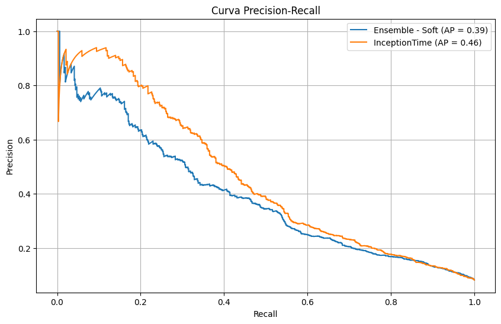

# An Approach for Electricity Fraud Detection using Smart Meters

Final project of my master in Computer Science & Technology at the University Carlos III of Madrid. The work is developed within the European project [AI-SMECOT: Artificial Intelligence Based Smart Meter - Grid an communication technologies for Critical Infrastructures](https://eurogia.eu/propidea/artificial-intelligence-based-smart-meter-grid-and-communication-technologies-for-critical-infrastructures-ai-smecot-19-05-2021/).

## Project Overview
This project aims to detect electricity fraud using data from smart meters. By leveraging machine learning and deep learning techniques, we can identify irregularities and potential fraudulent activities in electricity consumption.

## Table of Contents
- [Introduction](#introduction)
- [Dataset](#dataset)
- [Model](#model)
- [Results](#results)
- [Contributing](#contributing)
- [License](#license)

## Introduction

Our world is experiencing an increasing demand for electrical energy, requiring companies and organizations to adapt. However, this shift presents several challenges, one of which is reducing energy losses. These losses can be categorized into two main types: (1) Technical losses (TL), which include inherent losses in energy distribution, equipment inefficiencies, and other operational factors; and (2) Non-technical losses (NTL), associated with illegal connections, unpaid bills, and electricity fraud. NTLs alone have caused an estimated $96 billion in global economic losses each year. Beyond economic impacts, these issues also affect infrastructure, service quality, and pose public safety risks.

In response, European initiatives like AI-SMECOT aim to address these challenges by harnessing the power of artificial intelligence. One of the key goals is to detect fraudulent energy consumption using data collected from smart meters. In line with this objective, the present work implements an approach based on machine learning and deep learning techniques, combined with strategies to enhance model performance.

The results of this project will contribute to future deployments within the AI-SMECOT platform, supporting its objective of combating energy fraud.

## Dataset
The dataset used in this project is the one released by State Grid Corporation of China (http://www.sgcc.com.cn/). This is a realistic electricity consumption dataset that contains the electricity consumption data of 42,372 electricity customers within 1,035 days (from Jan. 1, 2014 to Oct. 31, 2016).

Data can be found in the following [link](https://github.com/henryRDlab/ElectricityTheftDetection)

## Model
As a result of the implemented processes, two algorithms (a machine learning solution and a deep learning solution) achieved the highest AUC and F1 scores. We prioritized the F1 score as a key metric to evaluate how effectively the model identifies and predicts fraudulent instances. Additionally, this metric was chosen for further comparisons with state-of-the-art projects.

## Results
The Ensemble of machine learning models trainned with the tsfresh extracted features achieves a F1 of 0.42 with a threshold of 0.45 and a AUC score of 0.82. In the case of the Deep learning model InceptionTime, it obtained an F1 of 0.45 with a threshold of 0.3 and an AUC of 0.831.

When compargin the Precision-recall curve, we can see inception time keep a high precision value as recall increase.

## Contributing
Contributions are welcome! Please read the [contributing guidelines](CONTRIBUTING.md) for more details.

## License
This project is licensed under the MIT License. See the [LICENSE](LICENSE) file for more information.